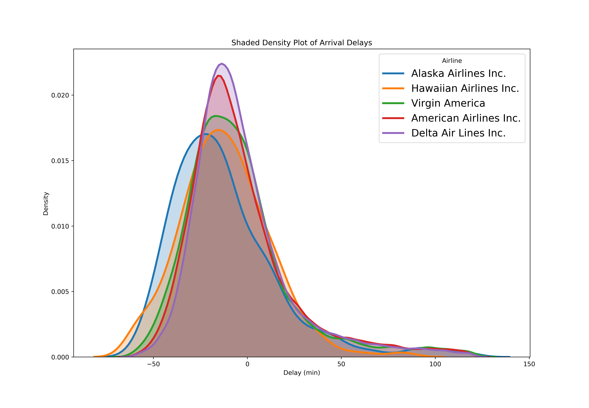

# Airline Data Analysis 
Visualizations and analysis for the NYCflights13 data set, this data set contains over 300,000 observations of flights departing NYC in 2013.

### Visualizations

#### Gaussian probability density plot of all airline arrival delays

#### top 5 airlines with lowest mean arrival delays visualized

